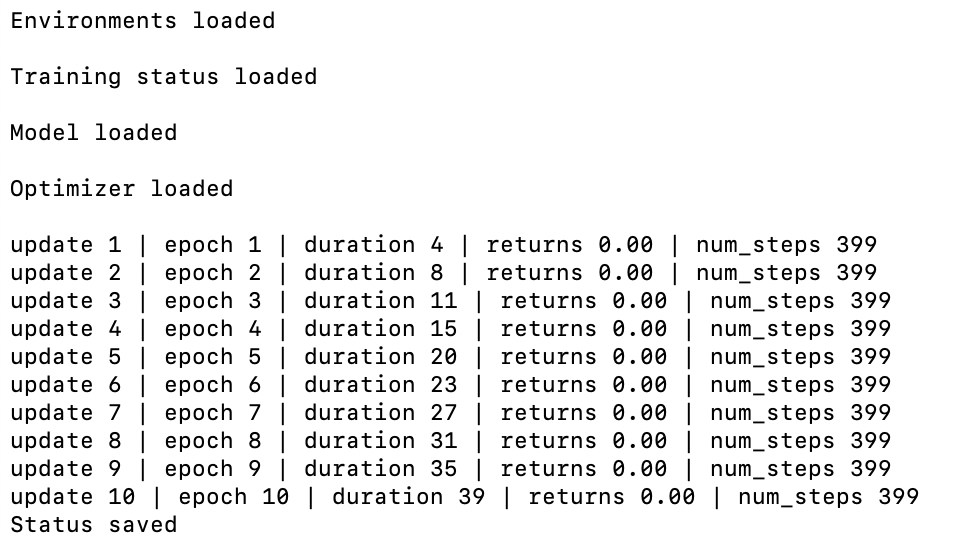
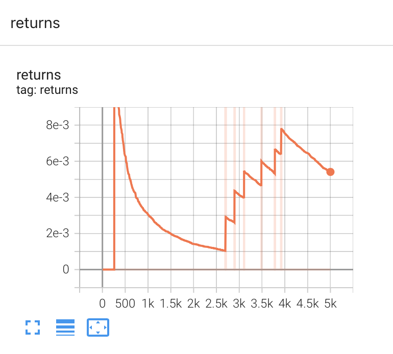

# MiniGrid

 This repository contains files to train and evaluate an agents on `gym-minigrid` environment. 

 <p align="center">
     
 </p>

 The agent can be trained using feUdal Network or hDQN algoritm. These files can be further modified to add different RL algorithms.


 ### Files and Folders 

 `/train.py`: script to train agent. 

 `/algos.py`: contains the code for algorithm implementation. 

 `model/`: contains code to define neural network architectures required for algorithm implementation.

 `envs/`: contains code required to customize the environment.  

 ### Example of Use
 
**Installation**

 1. Clone the repository.
 ```
 git clone https://github.com/ankitagarg26/rl-env.git
 cd minigrid
 ```

 3. If using docker then build the image and launch the container: 
 ```
 docker build -t minigrid_image
 docker run -it minigrid_image
 ``` 
 This should enter a bash script.

 If not using docker then install the required python libraries. `pip3 install -r requirements.txt`
 
**Training**

Example of use

 ```
 python3 train.py --algo=feudal --env=MiniGrid-Exp-V2-10x10 --epochs=5000 --save-interval=10
 ```
The script trains the model on FeUdal Network using the MiniGrid environment for 2500 episodes and saves it every 10 updates.

During training, logs are printed in the terminal (and saved in text and CSV format):

<p></p>

During training, logs are also plotted in Tensorboard:

<p></p>

### Add new algorithms

1. Create a new file defining required networks architectures and add it to folder `/model`.
2. Add a new file to folder `/algos` defining functions: `collect_experiences` and `update_parameters`.
3. Modfiy train.py file to add support for the new algorithm.

### Create customized environment

Create a class inheriting MiniGrid class and depending on the requirements, define the function `_gen_grid` in it. For further details, refer to file `envs\envs.py`. 

 ### References

 1. MiniGrid Documentation: https://minigrid.farama.org
 2. RL Starter Files: https://github.com/lcswillems/rl-starter-files
 3. FeUdal Networks for Hierarchical Learning: https://arxiv.org/abs/1703.01161
 4. Hierarchical Deep Reinforcement Learning: Integrating Temporal Abstraction and Intrinsic Motivation: https://arxiv.org/abs/1604.06057
